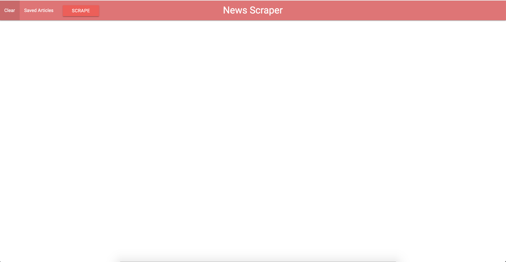
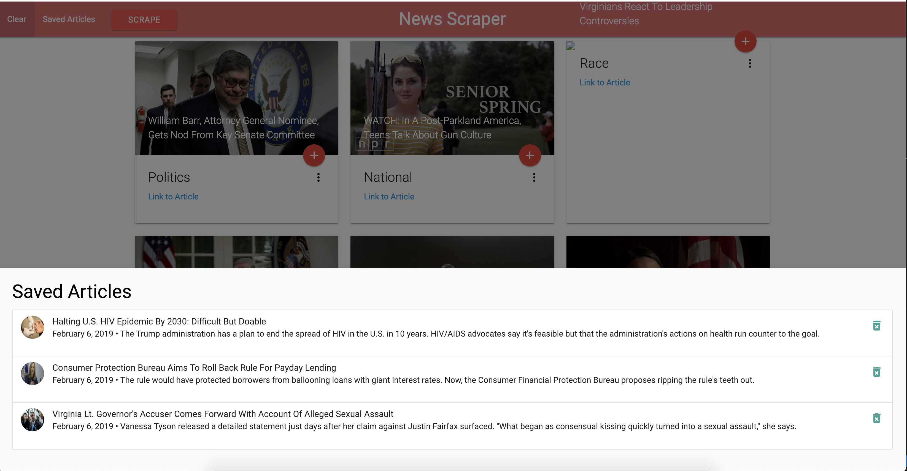
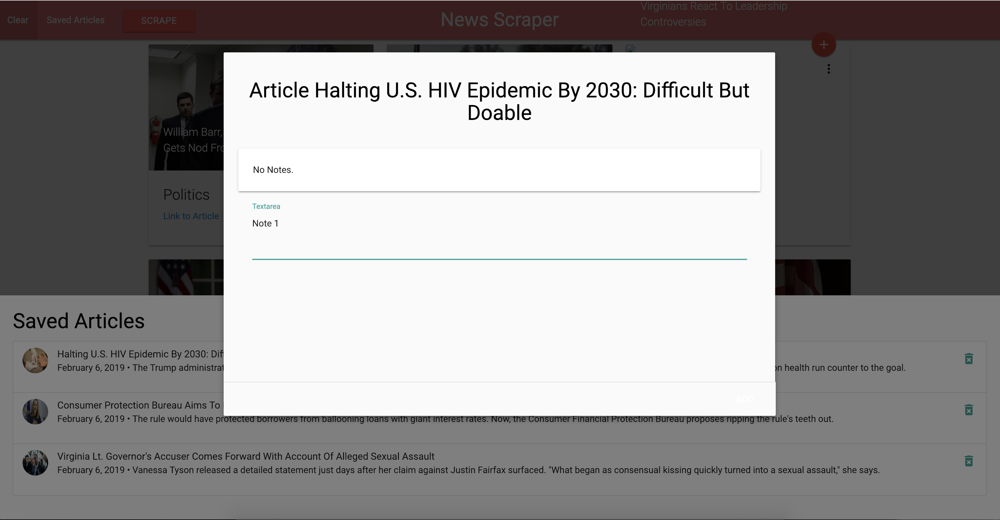

<h1>News Scraper</h1>

Live version: https://news-feed-41928.herokuapp.com/

Author: Swaroop Kondreddy

<h3> Main Page </h3>

<h2> Project overview</h2>
A web app that lets users view and leave comments on the latest news.

<h2>Technology used</h2>

[Node.js](https://nodejs.org/en/)

[Express](https://expressjs.com/)

[Heroku](https://heroku.com/)

[Handlebars](https://handlebarsjs.com/)

[MongoDB](https://www.mongodb.com/)

[Mongoose](https://mongoosejs.com/)

[Cheerio.js](https://cheerio.js.org/)

<h2>How it works</h2>

- Scrape the news
  
- Save an article for later use
- View saved article
  
- Add an article note
  
- Delete all saved articles and notes
